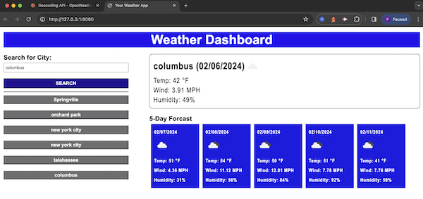

# Weather_with_3rdPartyAPI
Weather report using local location

## Description

The weather app is used to show current weather and the next five days, while user enters city.

## Usage

User enters city. City is then copied to a button below to disply history. Current weather and date is displayed, along with the next five days. When second city is added page is refreshed while still displaying history and showing the new cities weather.

## Deployment and GitHub

deployment:  https://pamwillis.github.io/Weather_with_3rdPartyAPI/

github: https://github.com/PamWillis/Weather_with_3rdPartyAPI.git

## License

MIT License

Copyright (c) [2023] [Pam Willis]

Permission is hereby granted, free of charge, to any person obtaining a copy
of this software and associated documentation files (the "Software"), to deal
in the Software without restriction, including without limitation the rights
to use, copy, modify, merge, publish, distribute, sublicense, and/or sell
copies of the Software, and to permit persons to whom the Software is
furnished to do so, subject to the following conditions:

The above copyright notice and this permission notice shall be included in all
copies or substantial portions of the Software.

THE SOFTWARE IS PROVIDED "AS IS", WITHOUT WARRANTY OF ANY KIND, EXPRESS OR
IMPLIED, INCLUDING BUT NOT LIMITED TO THE WARRANTIES OF MERCHANTABILITY,
FITNESS FOR A PARTICULAR PURPOSE AND NONINFRINGEMENT. IN NO EVENT SHALL THE
AUTHORS OR COPYRIGHT HOLDERS BE LIABLE FOR ANY CLAIM, DAMAGES OR OTHER
LIABILITY, WHETHER IN AN ACTION OF CONTRACT, TORT OR OTHERWISE, ARISING FROM,
OUT OF OR IN CONNECTION WITH THE SOFTWARE OR THE USE OR OTHER DEALINGS IN THE
SOFTWARE..

## Credit
This was created with assistants from AskBCS Learning assistants, my tutor Juan Delgato.
